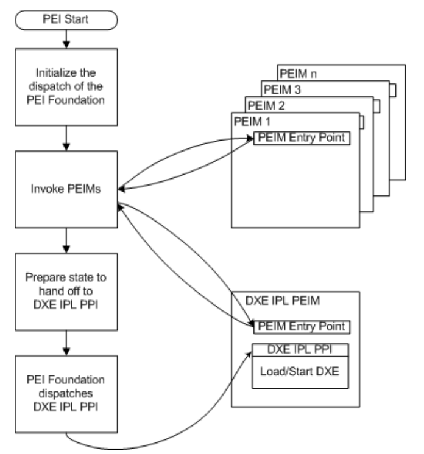
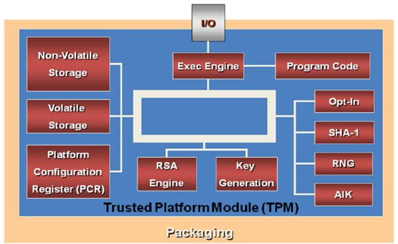

# UEFI Rootkit

Bachelor thesis about a UEFI Rookit communitcating witht the TPM module in an effort to gain trusted information from the windows boot process.

# UEFI

<!--
- https://en.wikipedia.org/wiki/Unified_Extensible_Firmware_Interface
- https://uefi.org/sites/default/files/resources/UEFI_Spec_2_7.pdf
- https://edk2-docs.gitbook.io/edk-ii-uefi-driver-writer-s-guide/3_foundation/31_basic_programming_model
-->

<!--
## Acronyms
Unified Extensible Firmware Interface (UEFI)
Platform Initialization (PI)
-->

## UEFI/PI Firmware Images

<!--
https://edk2-docs.gitbook.io/edk-ii-build-specification/2_design_discussion/22_uefipi_firmware_images
 -->

Firmware Images are stored in Flash Devices (FD), a Firmware Volume (FV) serves as file level interface. Usually multiple FVs are present in a single FD but a signle FV can also be distributed via multiple FDs. A FV is formatted with a binary file system, typically with Firmware File System (FFS).

In a FFS modules are stored as files, they can be executed at the fixed address from Read Only Memory (ROM) or through relocation in loaded memory. Within a file are multiple sections which then contain the "leaf" images. These are for example PE32 images.


Below is an image from the open source program [UEFITool](https://github.com/LongSoft/UEFITool), which lets you view the FFS of a FD. I opened an OVMF.fd built from the EDK II repository.


## Images

<!--
https://edk2-docs.gitbook.io/edk-ii-uefi-driver-writer-s-guide/3_foundation/readme.7
https://uefi.org/sites/default/files/resources/UEFI_Spec_2_7.pdf (2.1.1)
-->

UEFI Images are files containting executable code, they use a subset of the PE32+ (Microsoft Portable Executable and Common Object File Format Specification) format with a modified header signature. The format comes with relocation tables, this makes it possible that the images can be loaded at non predetermined addresses.

The images come in three different types:
- UEFI Applications
- UEFI Boot Services Drivers
- UEFI Runtime Drivers

Main differences between these types is  how and where they reside in memory. Applications are always unloaded when they return execution while drivers are only unloaded when they return an error code. Boot Services are unloaded after the bootloader calls `ExitBootServices()` while Runtime Drivers remain.

<!--
### Applications
- returns execution
- unloaded from memory afterwards
- not resident
- exception is os loader which does not return and instead calls `ExitBootServices()`
### Drivers
#### Boottime
- exist before `ExitBootServices()` is called
- `EfiBootServicesData` memory freed and reusable afterwards
#### Runtime
- stay after `ExitBootServices()` is called
- `EfiRuntimeServicesData` memory
- alternative calling mechanism during runtime
- handle database does not persist
-->

## System Table

The UEFI System Table is an important data structure, it provides access to system configuration information, boot services, runtime services and protocols.

## Protocols

Protocols provide an interface between two serperately built modules. They are associated with GUIDs and installed onto a handle by drivers.

They are essentially a C structure made up of function pointers and other data structures.

When a protocol is installed this structure is filled with pointers to function implementations within the drivers code. A client then searching with the same GUID and receives (device) handles associated with that protocol. After selecting the desired handle the same structure now is filled with pointers on the client side, allowing to call the function implementations provided by the driver.


## Boot Sequence

<!-- 
- https://edk2-docs.gitbook.io/edk-ii-build-specification/2_design_discussion/23_boot_sequence
- https://edk2-docs.gitbook.io/edk-ii-uefi-driver-writer-s-guide/3_foundation/readme.15
- https://uefi.org/sites/default/files/resources/ACPI_6_3_May16.pdf
- https://www.coreboot.org/images/6/6c/LBCar.pdf
- https://github.com/tianocore/edk2/blob/master/IntelFsp2Pkg/FspSecCore/Vtf0/Ia16/ResetVec.asm16
- https://github.com/tianocore/edk2/blob/master/IntelFsp2WrapperPkg/Library/SecFspWrapperPlatformSecLibSample/Ia32/SecEntry.nasm
- https://www.igorslab.de/en/inside-amd-bios-what-is-really-hidden-behind-agesa-the-psp-platform-security-processor-and-the-numbers-of-combo-pi/
- https://github.com/tianocore/edk2/blob/master/MdePkg/Library/PeiCoreEntryPoint/PeiCoreEntryPoint.c
- https://edk2-docs.gitbook.io/understanding-the-uefi-secure-boot-chain/
- https://edk2-docs.gitbook.io/edk-ii-minimum-platform-specification/
- https://github.com/orgs/tianocore-docs/repositories
- https://github.com/tianocore/tianocore.github.io/wiki/EDK-II-Documents
- https://opensecuritytraining.info/IntroBIOS.html
- https://trustedcomputinggroup.org/resources/?
-->


The UEFI boot sequence consists of 6 stages.


### 1. Security (SEC)

<!-- 
https://edk2-docs.gitbook.io/edk-ii-module-writer-s-guide/6_sec_module
 -->

The Security phase is the first code executed by the CPU, it is uncompressed and executed directly from flash. It consists of platform specific assembly.

- Handles all platform restart events (power on, wakup from sleep, etc)
- Creates a temporary memory state by configuring the CPU Cache as RAM (CAR) "no evictions mode"
- Serves as the root of trust in the system
- Passes handoff information to the Pre-EFI Initialization (PEI) Foundation


Since the CPU doesn't know about UEFI or BIOS the initial step is exactly the same, it starts in 16-bit real mode and fetches it's first instruction from `CS = 0xF000` and `IP = 0xFFF0` but instead of shifting `CS` left by four bits and adding `IP`, the `CS` base register is initialized to `0xFFFF'0000`. So the first instruction is fetched from the physical address `0xFFFF'FFF0` (`0xFFFF'0000 + 0xFFF0`). The CS base address remains at this initial value until the CS selector register is loaded by software (e.g. far jump or call instruction)

- Populates Reset Vector Data structure
- Saves Built-in self-test (BIST) status
- Enables protected mode (16 bit -> 32 bit)
- Configures temporary RAM (not only limited in processor cache) by using MTRR to configure CAR.

Passing of handoff information to the PEI phase:

```C
typedef VOID EFIAPI (*EFI_PEI_CORE_ENTRY_POINT)(IN CONST EFI_SEC_PEI_HAND_OFF *SecCoreData,
                                                IN CONST EFI_PEI_PPI_DESCRIPTOR *PpiList);
```

SEC Core Data:
- Points to a data structure containing information about the operating environment:
- Location and size of the temporary RAM
- Location of the stack (in temporary RAM)
- Location of the Boot Firmware Volume (BFV)
  
PPI list:

- Temporary RAM support PPI

An optional service that moves temporary RAM contents to permanent RAM.

- SEC platform information PPI

An optional service that abstracts platform-specific information to locate the PEIM dispatch order and maximum stack capabilities.

### 2. Pre-EFI Initialization (PEI)

<!-- 
- https://edk2-docs.gitbook.io/edk-ii-module-writer-s-guide/7_pre-efi_initialization_modules
- https://uefi.org/sites/default/files/resources/PI_Spec_1_7_final_Jan_2019.pdf
 -->

Configures a system meeting the minimum prerequisites for the Driver Execution (DXE) phase, which is generally a linear array of RAM large enough for successful execution.

PEI provides a framework allowing vendors to supply initialization modules for each functionally distinct piece of system hardware which must be initialized before the DXE phase.

PEI design goals of the PI architecture:

- Maintenance of the "chain of trust", includes protection and authorization of PEI modules
- Provide a core PEI module
- Independent developement of intialization modules

The PEI phase consists of the PEI Foundation core and specialized plug-ins known as Pre-EFI Initialization Modules (PEIMs).

Since the PEI phase is very early in the boot process it can't assume reasonable amounts of RAM so the features are limited:
- Locating, validating and dispatching PEIMs
- Communication between PEIMs
- Providing Hand-Off Data for DXE phase
- Initializing some permanent memory complement
- Describing the memory in Hand-Off Blocks (HOBs)
- Describing the firmware volume locations in HOBs
- Passing control into the Driver Execution Environment (DXE) phase
- Discover boot mode and possibly resume from sleep state



#### PEI Services

PEI Service Table visible to all PEIMs in the system, a pointer to this table is passed as an argument via the PEIM entry point, it is also part of each PEIM-to-PEIM Interface (PPI).


| Service                  | Description                                                                                                                                 |
| ------------------------ | ------------------------------------------------------------------------------------------------------------------------------------------- |
| PPI Services             | Manages PPIs to facilitate intermodule calls between PEIMs. Interfaces are installed and tracked on a database maintained in temporary RAM. |
| Boot Mode Services       | Manages the boot mode (S3, S5, normal boot, diagnostics, etc.) of the system                                                                |
| HOB Services             | Creates data structures called Hand-Off Blocks (HOBs) that are used to pass information to the next phase of the PI Architecture.           |
| Firmware Volume Services | Finds PEIMs and other firmware files in the firmware volumes                                                                                |
| PEI Memory Services      | Provides a collection of memory management services for use both before and after permanent memory has been discovered                      |
| Status Code Services     | Provides common progress and error code reporting services (for example, port 080h or a serial port for simple text output for debug).      |
| Reset Services           | Provides a common means by which to initiate a warm or cold restart of the system.                                                          |

#### PEI Foundation/Core

PEI Foundation code is portable across all platforms of a given instruction-set. The set of exposed services is the same across different microarchitextures and allows PEIMs to be written in C.

- Dispatches PEIMs
- Maintains boot mode
- Initializes permanent memory
- Invokes DXE loader

#### PEI Dispatcher

The PEI Dispatcher evaluates dependencies of PEIMs in the firmware volume, these dependencies are PPIs. The Dispatcher holds internal state machines to check dependencies of PEIMs, it starts executing PEIMs whose dependencies are statisfied to build up dependencies of other PEIMs, this is done until the dispatcher cannot invoke any more PEIMs. Then the DXE Initial Program Loader (IPL) PPI is invoked to pass control to the DXE phase.

#### Pre-EFI Initialization Modules (PEIMs)
PEIMs are specialized drivers that personalize the PEI Foundation to the platform. They are analogus to DXE driver and generally correspond to the components being initialized. It is strongly recommended that PEIMS do only the minimum necessary work to initialize the system to a state that meets the prerequisites of the DXE phase. PEIMs reside in firmware volumes (FVs).

#### PEIM-to-PEIM Interfaces (PPIs)
PEIMs communicate with each other using a structure called PPI. A PPI is a GUID pointer pair. The GUID is used to identifiy a certain service and the pointer provides access to data structures and services of the PPI.

There are two kinds of PPIs:
- Architectural PPIs
- Additional PPIs

An architectural PPI is described in the PEI Core Interface Specification (CIS) and the GUID is known to the PEI Foundation. They typically provide a common interface to the PEI Foundation to a service with platform specific implementation.

An additional PPI is important for interoperability but isn't required by the PEI Foundation, they can be classified as mandatory or optional.

  
### 3. Drive Execution Environment (DXE)

<!-- 
- https://edk2-docs.gitbook.io/edk-ii-module-writer-s-guide/8_dxe_drivers_non-uefi_drivers
- Beyond BIOS: Developing with the Unified Extensible Firmware Interface, Third Edition
 -->

- DXE Foundation/Core
- DXE Dispatcher
- DXE Drivers

#### DXE Foundation

The DXE Foundation produces a set of Boot, Runtime and DXE Services and exposes them through handle databases in the EFI System Table. It is designed to be completely portable, independent of processor, chipset and platform. The only dependent of the Hand-Off Blocks from the PEI phase, after these are processed the all prior phases can be unloaded. 

#### DXE Dispatcher

The DXE Dispatcher discovers DXE drivers within the Firmware Volume (FV) and executes them in the correct order, respecting their dependencies towards each other. The Firmware Volume file format allows the DXE driver images to be packaged with expressions about their dependencies. Since the DXE Drivers are PE/COFF images the dispatcher comes with an apropriate loader to load and execute the image format.

#### DXE Drivers

- Drivers that execute very early in the DXE phase
- Drivers that comply with the UEFI Driver Model

The DXE Drivers are responsible for initializing the processor, chipset,
and platform components as well as providing software abstractions for console and
boot devices in the form of services.
  
### 4. Boot Device Selection (BDS)

The DXE Foundation will hand control to the BDS Architectural Protocol after all of the DXE drivers whose dependencies have been satisfied have been loaded and executed by the DXE Dispatcher. 

- Initializing console devices based on the ConIn, ConOut, and StdErr environment variables
- Loading device drivers listed in the DriverOrder environment variables
- Attempting to load and execute boot selections list from the BootOrder environment variables

During the BDS phase new Firmware Volumes (FV) might be discovered and control is once again handed to the DXE Dispatcher to load drivers found on these additional volumes.

### 5. Transient System Load (TSL)

The Transient System Load (TSL) is primarily the OS vendor provided boot loader. Both the TSL and the Runtime Services (RT) phases may allow access to persistent content, via UEFI drivers and UEFI applications. Drivers in this category include PCI Option ROMs.

This phase ends when an OS boot loader calls 'ExitBootServices()'.

### 6. Runtime (RT)

Boot service drivers have been unloaded and only runtime services are accessible.

### 7. After Life (AL)

The After Life (AL) phase consists of persistent UEFI drivers used for storing the state of the system during the OS orderly shutdown, sleep, hibernate or restart processes.

<!-- 
## Typical Flash Part Layout
- https://edk2-docs.gitbook.io/edk-ii-build-specification/2_design_discussion/24_typical_flash_part_layout
- https://docs.microsoft.com/en-us/windows-hardware/design/device-experiences/oem-uefi-wsmt#:~:text=The%20Windows%20SMM%20Security%20Mitigation%20Table%20(WSMT)%20is%20an%20ACPI,Management%20Mode%20(SMM)%20software.
 -->

## Secure Boot

<!-- 
- https://edk2-docs.gitbook.io/understanding-the-uefi-secure-boot-chain/
- http://theory.stanford.edu/~ninghui/courses/Fall03/papers/clark_wilson.pdf
 -->

Secure boot ses a set of policy objects to verify the next entity before execution.
Trusted boot does not verify the next entity, it only records the digest of the next boot entity to a trusted ocation, such as a Platform Configuration Register (PCR) in the Trusted Platform Module (TPM). This allows a trusted boot chain to be verified later in the boot process.

<!--
- UEFI variables SMM handler
- protected range registers
-->

### Trusted Platform Module (TPM)

<!-- 
- https://en.wikipedia.org/wiki/Trusted_Platform_Module
- https://resources.infosecinstitute.com/topic/uefi-and-tpm-2/
- https://trustedcomputinggroup.org/resource/tpm-library-specification/
- https://trustedcomputinggroup.org/wp-content/uploads/TCG_ACPIGeneralSpecification-Family-1.2-and-2.0-Ver1.2-Rev8_public-revie....pdf
 -->

Trusted Platform Module (TPM) is a standard for a secure crypto library implementation (often a separate microcontoller) designed to secure hardware through integrated cryptographic keys. 


It is used for:

- Platform integrity (e.g. UEFI Secure Boot)
- Disk encryption (e.g. Bitlocker)
- Digital Rights Management (DRM)



# Current Research

<!--
- https://www.kb.cert.org/vuls/id/758382
- https://www.kb.cert.org/vuls/id/976132
- https://www.kb.cert.org/vuls/id/631788
- https://github.com/hackedteam/vector-edk
- https://github.com/Mattiwatti/EfiGuard
- https://github.com/quarkslab/dreamboot
-->

## LoJax

<!--
- https://www.welivesecurity.com/wp-content/uploads/2018/09/ESET-LoJax.pdf
-->

The LoJax rootkit works only on misconfigured or older systems, this is because it is written directly into the firmware's SPI flash with an exploit that is was fixed with the introducation of the Platform Controller Hub chipsets in 2008. The rootkit dumps the current firmware into an image and places malicious drivers into the Firmware File Sytstem (FFS). These drivers register Notify functions on the event `EFI_EVENT_GROUP_READY_TO_BOOT` which is signaled right before a bootloader chooses a boot device. When the Notify callback function is called it searches for windows partitions and installs user level software in their windows installations. For this it comes with it's own NTFS driver and removes potentially conflicting drivers already in the FFS.

Since the malicious component resides in the SPI flash memory a hard drive wipe or replacement can't restore the system integrity.

## MosaicRegressor

<!--
- https://www.bleepingcomputer.com/news/security/mosaicregressor-second-ever-uefi-rootkit-found-in-the-wild/
- https://media.kasperskycontenthub.com/wp-content/uploads/sites/43/2020/10/07080558/MosaicRegressor_Technical-details.pdf
- https://securelist.com/mosaicregressor/98849/
- https://github.com/hackedteam/vector-edk
-->

The MosaicRegressor rootkit is similar to LoJax as it also resides in the FFS. It is mostly based on a [bootkit from Hacking Team](https://github.com/hackedteam/vector-edk) which also registers a Notify function on the `EFI_EVENT_GROUP_READY_TO_BOOT` event and also comes with an NTFS driver.

## FinSpy

<!--
https://securelist.com/finspy-unseen-findings/104322/
 -->

The FinSpy rootkit is, contrary to LoJax' and MosaicRegressor's approach of residing in the FFS, an EFI System Partition rootkit. It replaces the original windows boot manager which loads the original and patches it before execution. The patched version spawns another thread installing mallicious user level software.
## ESPecter

<!--
https://www.welivesecurity.com/2021/10/05/uefi-threats-moving-esp-introducing-especter-bootkit/
 -->

The ESPEcter rootkit is similar to FinSpy also a EFI Sistem Partition based rootkit. It directly patches the windows boot manager allowing it to install windows drivers while bypassing the Windows Driver Signature Enforcement (DSE).

## MoonBounce

<!--
https://securelist.com/moonbounce-the-dark-side-of-uefi-firmware/105468/
 -->

The MoonBounce rootkit is like LoJax and MosaicRegressor an SPI flash rootkit. Instead of installing malicious UEFI drivers it hooks functions in the core of the Driver Execution Environment (DXE) of the firmware. This allows it to introduce mallicious drivers to the windows kernel address space which in turn install user level software.

<!--
## DerStarke QuarkMatter

https://wikileaks.org/ciav7p1/cms/page_26968082.html
https://wikileaks.org/ciav7p1/cms/page_21561434.html
-->

# Library Comparison

## TianoCore EDK II

https://github.com/tianocore/edk2

The first Open Source implementation of the UEFI specification.

## Project Mu

https://github.com/microsoft/mu/

Microsoft fork of EDK II with a focus of small deployment cycles.


## GNU-EFI

https://sourceforge.net/p/gnu-efi/code/ci/master/tree/

A small implementation using the native GNU tool chain, which only supports building applications.

## POSIX-UEFI

https://gitlab.com/bztsrc/posix-uefi

A small library inspired by GNU-EFI and even smaller in size.

<!--
# Rootkit

- https://docs.microsoft.com/en-us/windows/security/information-protection/secure-the-windows-10-boot-process
-->

# Implementation

<!--
- https://github.com/tianocore/tianocore.github.io/wiki/Getting-Started-with-EDK-II
- https://github.com/tianocore/tianocore.github.io/wiki/EDK-II-Platforms
- https://github.com/tianocore/tianocore.github.io/wiki/EDK-II-Documents
- https://github.com/tianocore/tianocore.github.io/wiki/UEFI-EDKII-Learning-Dev
- https://edk2-docs.gitbook.io/edk-ii-uefi-driver-writer-s-guide/
- https://edk2-docs.gitbook.io/edk-ii-uefi-driver-writer-s-guide/2_uefi_driver_implementation_checklist/22_how_to_implement_features_in_edk_ii
- https://stackoverflow.com/questions/63725239/build-edk2-in-linux
- https://github.com/tianocore/tianocore.github.io/wiki/Getting-Started-Writing-Simple-Application
- https://edk2-docs.gitbook.io/edk-ii-build-specification/
-->

## UefiExamplePkg

This is a simple EDK II package consiting of an application, a driver and a protocol. It serves as a first introductory exercise to UEFI programming. The driver implements and installs a protocol called `Answer` which the application then can search for. If the application is able to find an instance of the protocol the protocol function `GetAnswer` is called and it's output is printed to console. If the application is not able to find an instance it will print that to the console. In both cases the application terminates and can be launched to try again.


# How to Build

## Setting up EDK II

Follow [Getting Started with EDK II](https://github.com/tianocore/tianocore.github.io/wiki/Getting-Started-with-EDK-II#how-to-setup-a-local-edk-ii-tree) by selecting the appropriate guide for your build environment. Stop at [Setup build shell environment](https://github.com/tianocore/tianocore.github.io/wiki/Common-instructions#setup-build-shell-environment) in the [common instructions](https://github.com/tianocore/tianocore.github.io/wiki/Common-instructions).

Clone repository and change directory:
```
git clone https://github.com/powware/uefi-rootkit.git
cd uefi-rootkit
```

Now set the following environment variables:
- `WORKSPACE` to the cloned repository (e.g. `export WORKSPACE=~/repos/uefi-rootkit`)
- `PACKAGES_PATH` to the `src` folder of this repository as well as the edk2 repository (e.g. `export PACKAGES_PATH=~/repos/uefi-rootkit/src/:~/repos/edk2`)
- Add the edk2 repository to your `PATH`


and run this script:
```
. edksetup.sh
```

_**Note**: Every new session requires the environment variables to be set and the script to be run._


In `Conf/target.txt` you need to change `TARGET_ARCH` to `X64` and `TOOL_CHAIN_TAG` to use your tool chain (`Conf/tools_def.txt` has a list of all tool chains and allows for custom definitions). I entered `GCC5` to use my gcc 11.2.0 installation.

## Building UefiExamplePkg

To build this package have EDK II setup with all the needed environment variables and enter:
```
build -p src/UefiRootkitPkg/UefiRootkitPkg.dsc
```

# Usage

## Obtaining an OVMF image

You will need a UEFI firmware image for QEMU emulation. You can either [build one yourself](https://github.com/tianocore/tianocore.github.io/wiki/How-to-build-OVMF) from the EDK II repository or download precompiled images [here](https://www.kraxel.org/repos/) or install the `ovmf` apt repository.

<!--
## UEFI Shell
-->

## Running UefiExmaplePkg

Using QEMU and the UEFI emulation firmware you need to enter (make sure to use an absolute path with the `-hda` option):
```
qemu-system-x86_64 --bios <path to>/OVMF.fd -net none -hda fat:rw:<absolute path to>/uefi-rootkit/build/<tool chain>/X64
```

You should now see the UEFI shell, change to the file directory:
```
fs0:
```
No you can launch the application:
```
.\Application.efi
```
The application was not able to find an instance of the protocol it wanted to access and is unable to print an answer.

Start the driver first and then launch the application this time:
```
load Driver.efi
.\Application.efi
```
Loading the driver before launching the application allows the driver to install an instance of the protocol. The application was now able to find a protocol instance and could call the offered function to print an answer.

That's it!

# Sources

- https://docs.microsoft.com/en-us/windows/security/information-protection/secure-the-windows-10-boot-process
- https://www.welivesecurity.com/wp-content/uploads/2018/09/ESET-LoJax.pdf
- https://www.bleepingcomputer.com/news/security/mosaicregressor-second-ever-uefi-rootkit-found-in-the-wild/
- https://securelist.com/mosaicregressor/98849/
- https://en.wikipedia.org/wiki/Unified_Extensible_Firmware_Interface
- https://github.com/tianocore/edk2
- https://en.wikipedia.org/wiki/TianoCore_EDK_II
- https://github.com/microsoft/mu/
- https://microsoft.github.io/mu/faq/
- https://uefi.org/sites/default/files/resources/UEFI_Spec_2_3_1.pdf
- https://uefi.org/sites/default/files/resources/UEFI_Spec_2_9_2021_03_18.pdf
- https://edk2-docs.gitbook.io/edk-ii-uefi-driver-writer-s-guide/
- https://www.youtube.com/watch?v=CGBpil0S5NI
- https://www.youtube.com/watch?v=P3yMXspLzoY
- https://wiki.osdev.org/UEFI
- https://wiki.osdev.org/GNU-EFI
- https://sourceforge.net/p/gnu-efi/code/ci/master/tree/
- https://wiki.osdev.org/POSIX-UEFI
- https://gitlab.com/bztsrc/posix-uefi
- https://doc.coreboot.org/
- https://github.com/tianocore/tianocore.github.io/wiki/Getting-Started-with-EDK-II
- https://github.com/tianocore/tianocore.github.io/wiki/EDK-II-Documents
- https://github.com/tianocore/tianocore.github.io/wiki/EDK-II-Platforms
- https://github.com/tianocore/tianocore.github.io/wiki/UDK
- https://uefi.org/learning_center/papers/
- https://docs.fedoraproject.org/en-US/Fedora/18/html-single/UEFI_Secure_Boot_Guide/index.html#idm59538656
- https://wiki.ubuntu.com/UEFI/SecureBoot
- https://github.com/rhboot/shim

<!--
# Writer Guide Broken:
- https://edk2-docs.gitbook.io/edk-ii-uefi-driver-writer-s-guide/3_foundation/34_handle_database
- https://edk2-docs.gitbook.io/edk-ii-uefi-driver-writer-s-guide/3_foundation/readme.8
- https://edk2-docs.gitbook.io/edk-ii-uefi-driver-writer-s-guide/appendix_b_edk_ii_sample_drivers
- https://edk2-docs.gitbook.io/edk-ii-uefi-driver-writer-s-guide/3_foundation/readme.15/31510_boot_manager_driver_list_processing
-->